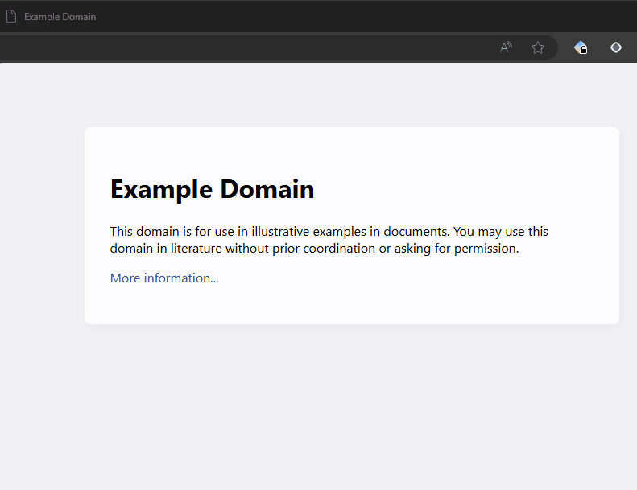

## SurfBoosts

<!-- Include demo gif -->



Inspired by [Boosts by Arc](https://www.youtube.com/watch?v=N0jMmiCS8oQ) SurfBoosts is a browser plugin that gives you the ability to inject custom CSS and JavaScript into any website. Allowing to customize the look and feel of any webpage, or even adding new features. The main benefit of SurfBoosts is that it is not built in into the browser and works as a separate browser extension allowing to target multiple platforms. Also there is a more intricate 3 levels boosts organization system.

## Table of contents

- [Possible use cases](#possible-usecases)
- [Organization system](#organization-system)
- [Match Patterns](#match-patterns)
- [Installation](#installation)
- [Testing](#testing)
- [Other commands](#other-commands)
- [Usage](#usage)
- [Roadmap](#roadmap)

### Possible usecases

- Dark mode for websites that don't have it.
- Remove annoying elements from websites.
- Run custom JavaScript code in website context.
- Customize the look and feel of any page.
- Or anything else that you would write a small browser extension for.

### Organization system

There are 3 levels of boosts organization:

1. Pack(level 1): It is used to create a sharable group of boosts. Highest level of grouping. It is also sharable.
2. Category(level 2): most commonly it is used to group boosts that are related to a specific feature or a page.
3. Group(level 3): it is used to group boosts that are related to a specific element or a part of a page.

The organization system is optional but for bigger collections of boosts it can be very useful. Also this is only a suggestion of how to organize your boosts, you can use it however you want.

### Match Patterns

[Match Patterns](https://developer.chrome.com/docs/extensions/develop/concepts/match-patterns) is a way to specify which URLs the boost should be applied to. It doesn't matter what pack/category/group the boost is in, if the URL matches the match patterns the boost will be applied. A single boost can have 1 or more match patterns.

Typically you would want to cover both http and https versions of the website. For example if you want to apply the boost to all pages on `example.com` you would use the following match patterns:

`*://*.example.com/` - applied both on http and https versions of the website only on index page.

`*://*.example.com/*` - applied both on http and https versions of the website on all pages.

`<all_urls>` - applied to all websites

#### Caveat

`*://*.example.com` will not work. You need to be specific on what page the boost must be applied on hence the trailing `/` symbol `*://*.example.com/`.

### Installation

This project is using [pnpm](https://pnpm.io/) as package manager. You can install it using npm:

```bash
npm install -g pnpm
```

1. Install all dependencies: `pnpm install`
2. Build the project: `pnpm build`

   - Chromium based browsers: `pnpm run build`

3. Load the extension in your browser:

   - Chrome: Open `chrome://extensions`, enable `Developer mode`, click on `Load unpacked` and select the `chrome-mv3-prod` directory.
   - Edge: Open `edge://extensions`, enable `Developer mode`, click on `Load unpacked` and select the `chrome-mv3-prod` directory.

### Testing

To run the tests, use the following command:

```bash
pnpm test:e2e
```

This will create a specialized build for running end-to-end tests and initiate tests runner.

### Other commands

`pnpm dev` - create a dev build, it supports hot reloads
`pnpm pre-commit` - runs formatting, linting, type checking and testing commands
`packs:build-prod` - builds packs in `packs-repo` directory and stores them in `built-packs` directory
`packs:build-dev` - builds packs in `packs-repo` directory and stores them in `built-packs-dev` directory
`packs-serve-dev` - launches local server that serves packs from `built-packs-dev` directory

### Usage

1. Open the extension popup by clicking on the icon in the browser toolbar.
2. Click on the `+` button to create a new boost.
3. Fill the:
   - Boost name
   - Match Patterns: The URL patterns that the boost should be applied to.
   - Pack: First level grouping
   - Category: Second level grouping
   - Group: Third level grouping
   - CSS: The CSS code that should be injected.
   - JS: The JavaScript code that should be injected.
4. Click on the `Save` button to save the boost.

Css will be applied immediately after saving the boost. For JS to be applied you need to refresh the page.

### Roadmap

- [x] Install boosts from a public repo
- [ ] Import/Export boosts. (Allows to export boosts to a file and import them on another device)
- [ ] Boost sharing. (Allows to submit boosts to online repository and view them on boosts store)
- [x] Boost input/edit form validation (Currently there is no validation for input fields allowing for nonsensical boosts to be created)
- [ ] Boost variables (Allows to use user defined variables in CSS and JS code)
